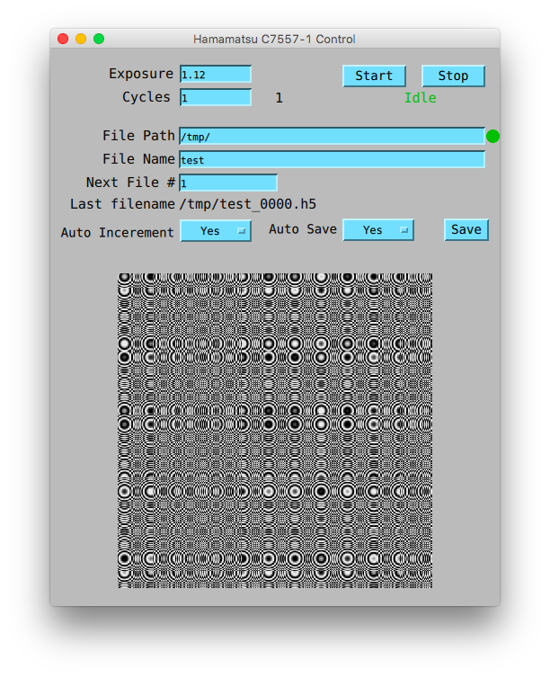

Demo PCASpy application in CCD control
======================================

This is a PCASpy application controlling one or more Hamamatsu MCD C7577-1 Controllers.
Only that in this demo, the hamamatsu module is replaced with a dummy simulation, while
preserving the same interface.

It is easy to get started with a conda environment::

    $ conda install numpy, scipy, h5py, pyqtgraph
    $ conda install -c paulscherrerinstitute pcaspy cachannel
    $ python ioc.py

And then control it with any CA client::

    # setup the file output
    $ caput -S iMott:FilePath "/tmp"
    $ caput -S iMott:FileName "test"

    # acquire and show th data 
    $ caput -c -w 5 iMott:Acquire 1
    $ caget -# 10 iMott:ArrayData

The live image can be displayed by the live.py module::

    $ python live.py

The saved HDF5 image files can be opened by viewer module::

    $ python viewer.py /tmp

There is also a builtin GUI written in QtQuick::

    $ conda install -c paulscherrerinstitute csdataquick
    # restart the server with GUI
    $ python ioc.py --gui

